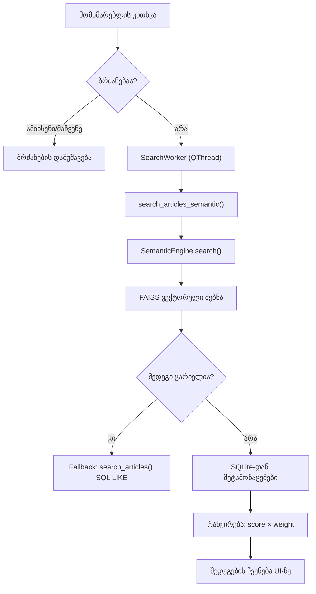

# ძებნის ალგორითმის სრული ტექნიკური დოკუმენტაცია

## 1. ზოგადი არქიტექტურა

სისტემა იყენებს **ჰიბრიდულ ძებნას**: სემანტიკური (AI ემბედინგები) + ტექსტური (SQL LIKE) ფოლბექით. 



---

## 2. ძებნის ბილიკი ეტაპობრივად

### ეტაპი 1: მომხმარებლის შეყვანა
**ფაილი:** [main.py](file:///d:/1kanonebi/main.py) → `search_articles()` (ხაზი 233)

მომხმარებელი წერს ტექსტს საძიებო ველში და აჭერს Enter-ს ან `>` ღილაკს.

**რა ხდება:**
1. ცარიელი ტექსტის შემოწმება → თუ ცარიელია, არაფერი ხდება
2. **ბრძანების პარსინგი** — ჯერ მოწმდება, ხომ არ არის სპეციალური ბრძანება:
   - `"ამიხსენი"`, `"გამიმარტე"`, `"რა წერია"`, `"დამიღეჭე"` → AI ანალიზი
   - `"მაჩვენე სსკ"` → კანონის სრული ტექსტის ჩვენება
3. თუ ბრძანება არ არის → გადადის **სემანტიკურ ძებნაზე**

### ეტაპი 2: ფონური ნაკადის გაშვება
**ფაილი:** [main.py](file:///d:/1kanonebi/main.py) → `SearchWorker` (ხაზი 36)

- UI-ზე ჩნდება `"მიმდინარეობს ძებნა..."` შეტყობინება
- **კანონის ფილტრი** (Active Tags) — თუ მომხმარებელს აქვს მონიშნული კონკრეტული კანონი (მაგ. "საგზაო მოძრაობის შესახებ"), ძებნა მხოლოდ ამ კანონში ხდება
- `SearchWorker(QThread)` კლასი ეშვება **ცალკე ნაკადში**, რომ UI არ გაიყინოს
- ნაკადი იძახებს: `db.search_articles_semantic(query, law_filter)`

---

### ეტაპი 3: სემანტიკური ძებნა (FAISS)
**ფაილი:** [database_manager.py](file:///d:/1kanonebi/database_manager.py) → `search_articles_semantic()` (ხაზი 98)

#### ნაბიჯი 3.1: ვექტორული ძებნა
`SemanticEngine.search(query, top_k=40)` — [semantic_engine.py](file:///d:/1kanonebi/semantic_engine.py) ხაზი 81

**რა ხდება:**
1. **კითხვა გარდაიქმნება ვექტორად** — `model.encode([query])` (MiniLM-L12-v2 მოდელი)
2. ვექტორი **ნორმალიზდება** — `faiss.normalize_L2(query_vector)` (Cosine Similarity-სთვის)
3. **FAISS ინდექსში ძებნა** — `index.search(query_vector, top_k=40)`
   - ინდექსი: `IndexFlatIP` (Inner Product = Cosine Similarity ნორმალიზებული ვექტორებისთვის)
   - აბრუნებს: `distances` (ქულები 0-დან 1-მდე) და `indices` (vector_id-ები)
4. შედეგი: `[{vector_id: 42, score: 0.85}, {vector_id: 17, score: 0.73}, ...]`

> **score** = Cosine Similarity (0.0 = არანაირი კავშირი, 1.0 = იდეალური დამთხვევა)

#### ნაბიჯი 3.2: SQLite-დან მეტამონაცემების ამოღება
**ფაილი:** [database_manager.py](file:///d:/1kanonebi/database_manager.py) ხაზი 110-128

- FAISS-დან მიღებული `vector_id`-ებით SQLite-დან ამოდის:
  - `law_name` — კანონის სახელი
  - `article_no` — მუხლის ნომერი
  - `content` — მუხლის ტექსტი
  - `weight` — კანონის წონა (კონსტიტუცია = 1.0, დანარჩენი = 0.8)
  - `part`, `book`, `chapter` — იერარქიული სტრუქტურა

- თუ მომხმარებელს მონიშნული აქვს კონკრეტული კანონი (`law_filter`), SQL ფილტრავს: `AND law_name IN (...)`

#### ნაბიჯი 3.3: რანჟირება
**ფაილი:** [database_manager.py](file:///d:/1kanonebi/database_manager.py) ხაზი 131-148

**ფორმულა:**
```
FinalScore = CosineSimilarity × Weight
```

**წონების სისტემა:**
| კანონი | weight | პირობა |
|--------|--------|--------|
| კონსტიტუცია (cosine > 0.7) | **1.2** | პრიორიტეტულია |
| კონსტიტუცია (cosine ≤ 0.7) | 1.0 | ჩვეულებრივი |
| სხვა კანონები | 0.8 | სტანდარტი |

**მაგალითი:**
- მუხლი A: cosine=0.85, კონსტიტუცია → FinalScore = 0.85 × 1.2 = **1.02**
- მუხლი B: cosine=0.90, სსკ → FinalScore = 0.90 × 0.8 = **0.72**
- **A ამარჯვებს B-ს**, მიუხედავად იმისა რომ B-ს უფრო მაღალი cosine similarity ჰქონდა

შედეგები ლაგდება `FinalScore`-ის კლებადობით. აბრუნებს პირველ 20 ჩანაწერს.

---

### ეტაპი 4: Fallback — ტექსტური ძებნა
**ფაილი:** [database_manager.py](file:///d:/1kanonebi/database_manager.py) → `search_articles()` (ხაზი 60)

**როდის ეშვება:** მხოლოდ თუ FAISS ვერაფერს პოულობს (ინდექსი ცარიელია ან არ არსებობს).

**ლოგიკა:**
1. კითხვა იყოფა სიტყვებად: `"ავარია მოვყევი"` → `["ავარია", "მოვყევი"]`
2. 2 სიმბოლოზე მოკლე სიტყვები ფილტრდება
3. SQL: `WHERE (content LIKE '%ავარია%' OR title LIKE '%ავარია%') OR (content LIKE '%მოვყევი%' OR title LIKE '%მოვყევი%')`
4. დალაგდება `weight DESC` — კონსტიტუცია პირველი
5. `LIMIT 20`

---

### ეტაპი 5: შედეგების ჩვენება
**ფაილი:** [main.py](file:///d:/1kanonebi/main.py) → `display_search_results()` (ხაზი 287)

`SearchWorker`-ის `results_ready` სიგნალი ემიტირებს შედეგებს მთავარ ნაკადში:
1. ძველი შედეგები სუფთავდება
2. შეჯამების ბარათი ჩნდება: `"თქვენ ეძებდით: "ავარია". მოიძებნა 15 მუხლი."`
3. თითოეული შედეგისთვის იქმნება `ArticleCard` ვიჯეტი:
   - **სათაური:** კანონის სახელი
   - **მუხლი:** ნომერი
   - **ტექსტი:** content (შემოჭრილი)

---

## 3. ემბედინგის მოდელი

| პარამეტრი | მნიშვნელობა |
|-----------|-------------|
| მოდელი | `paraphrase-multilingual-MiniLM-L12-v2` |
| ვექტორის ზომა | 384 განზომილება |
| ენა | მულტილინგვური (ქართულის მხარდაჭერით) |
| RAM მოხმარება | ~420 MB |
| ინდექსის ტიპი | FAISS `IndexFlatIP` (Inner Product) |

---

## 4. მონაცემთა ნაკადის სქემა

```
მომხმარებელი → [საძიებო ველი] → search_articles(query)
                                         │
                                  ┌───────┴───────┐
                                  │  ბრძანებაა?   │
                                  └───┬───────┬───┘
                                 კი   │       │  არა
                                      ▼       ▼
                              AI ანალიზი   SearchWorker(QThread)
                                               │
                                               ▼
                                   db.search_articles_semantic(query, law_filter)
                                               │
                                    ┌──────────┴──────────┐
                                    ▼                     ▼
                            SemanticEngine.search()   (Fallback)
                            FAISS ვექტორული ძებნა    SQL LIKE ძებნა
                                    │
                                    ▼
                            vector_id → SQLite → მეტამონაცემები
                                    │
                                    ▼
                            FinalScore = cosine × weight
                                    │
                                    ▼
                            დალაგება → top 20 → UI ბარათები
```

---

## 5. ფაილების როლები

| ფაილი | როლი |
|-------|------|
| `main.py` | UI ლოგიკა, ბრძანებების პარსინგი, ნაკადების მართვა |
| `database_manager.py` | SQLite + FAISS-ის ორკესტრაცია, რანჟირება |
| `semantic_engine.py` | MiniLM მოდელი, FAISS ინდექსი, ვექტორული ძებნა |
| `ai_engine.py` | Gemini API (მოდელი: `gemini-3.1-pro-preview`), სტრიმინგ ანალიზი |
| `gui_components.py` | ArticleCard, SearchField, ArticleDetailsWindow |
| `theme.py` | CSS სტილები |
| `data_loader.py` | კანონების ტექსტური ფაილებიდან ჩატვირთვა |

---

## 6. SQLite ბაზის სტრუქტურა

```sql
CREATE TABLE laws (
    id INTEGER PRIMARY KEY AUTOINCREMENT,
    law_name TEXT NOT NULL,     -- "საქართველოს სისხლის სამართლის კოდექსი"
    part TEXT,                  -- კარი / ნაწილი
    book TEXT,                  -- წიგნი
    chapter TEXT,               -- თავი
    article_no TEXT,            -- "126" ან "126-ე პრიმა"
    title TEXT,                 -- მუხლის სათაური
    content TEXT,               -- მუხლის სრული ტექსტი
    category TEXT,              -- "law", "constitution"
    weight REAL DEFAULT 0.8,    -- კონსტიტუცია=1.0, დანარჩენი=0.8
    vector_id INTEGER           -- FAISS ინდექსთან კავშირი
);
```

---

## 7. ცნობილი შეზღუდვები

1. **MiniLM მოდელი** — ზოგჯერ ვერ ჩაწვდება ძალიან აბსტრაქტულ ქართულ იურიდიულ ნუანსებს
2. **ტექსტური Fallback** — SQL LIKE ეძებს მხოლოდ ზუსტ substring-ს, ქართული მორფოლოგია (ბრუნვები, ზმნის ფორმები) არ მუშაობს
3. **რანჟირების წონები** — ამჟამად მხოლოდ კონსტიტუციას აქვს გაზრდილი წონა, სხვა კანონებს შორის პრიორიტეტი არ არის
